# FunTime-Quiz

 Funtime- Quiz site is  an educational website- The user is test on on his/her knowledge on science and Nature. The site is user friendly and accesseble for screen reader.  It  has  5 sections; Home , contact, play, Quiz, score sections.
. View the live site here
 [here]( https://ujuadimora-dev.github.io/FunTime-Quiz/)

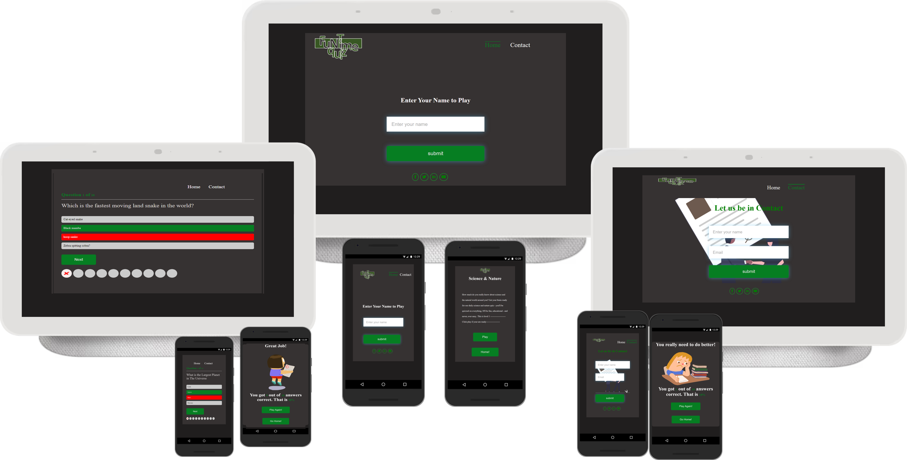

## Features 

### Site wide
*	Navigation Menu
*	Contains links to the Home, and Contact  pages and will be responsive at 320px, 600px, , 50em. 1024px
*	This will allow users to easily navigate between the pages within the site on these sizes devices.


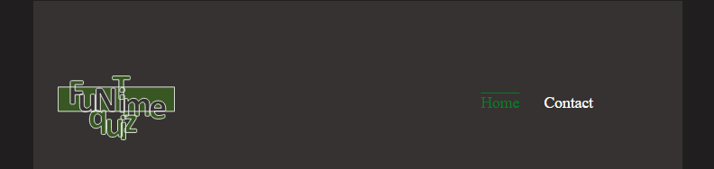

*	Footer
*	This  contain icons as links to social media websites that will open in new tabs. Icons will be accessible to the visually impaired who may be using a screen reader, by the use of aria labels. 
*	The social media link will allow the user to follow the 'FunTime-Quiz site' on various social media where they can get more up to date information that may not be displayed on the website. The contact information will allow the user to contact 'FunTime-Quiz' directly
*	


## Landing Page
* Landing page image
* This will help to immediately  fillin his/her name.

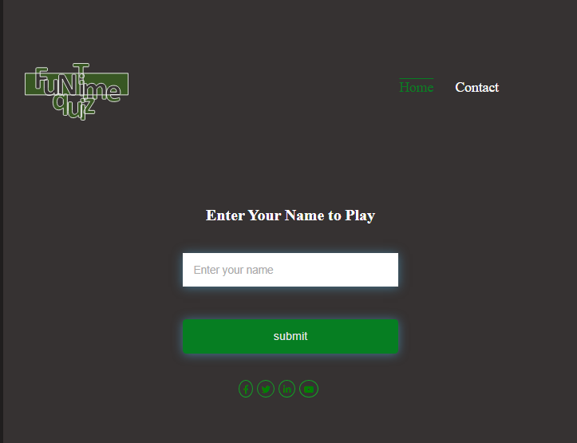

*	The user needs to fill simple form. Only the name'( Note: the user MUST fill in the name to be allowed to submit)
*	Then the user will click submit button
*	There is FunTime-quiz logo design by me. I used micerosoft office to  website design it.	
*	The Home page is highlighted with a green color to show the page's active 

## Play page
* Below is the image of the play page.

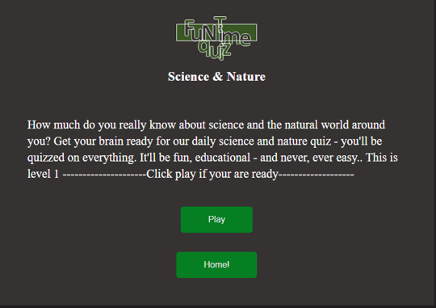

* This section instruct the user what type of quiz(in this  case general knowledge on Nature and science)
 is going to take so as to prepare his mind to be ready.
 1. Its tell the user that is not going be to be easy.
2. It also tell the user that is going to be FUN  and Educational.

## Contact page
ContactPage
This page shows the contact form

*	Contact form
*	This contact form is implemented to allow users to contact 'FunTime-Quiz' 
*	Username (is a must;  if the user did not put in his/her name, the system will complain that the name must be writing)
*	Email (a must ;if the user did not put in his/her email and must contain(@), the system will complain that the email with (@) must be writing))
* On successful submission of the contact form, the user will be navigated to Thank.html displaying Thank you message.


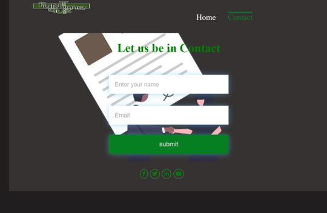


## Thank you page
*  This page shows the whrn the user successful subit the contact form.


## Quiz section
### Quiz  section Page( the credit goes to this site https://youtu.be/2Bpiluefkh8 , it is a You Tube  tutorial video)
* This page has ten(10) questions and four (4)options to select from each time a question is being asked
The  consists of ;
1.Score borad for the Great Score
2. Score board for a poor score or result
3. The user must select option before going to another question


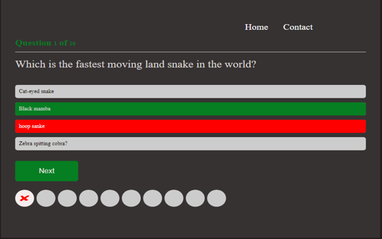

Great Result or score is when the user score above 5( that is >6). As shown in the image below

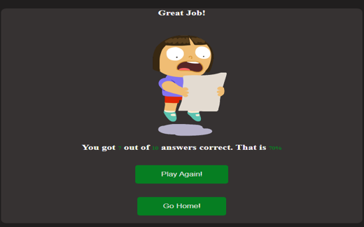

Poor The result or score is when the user score between 0 and 6. As shown below

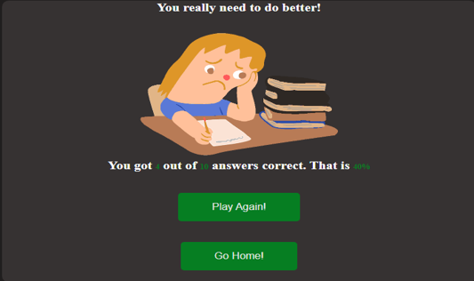

## The following steps below shows how the App works
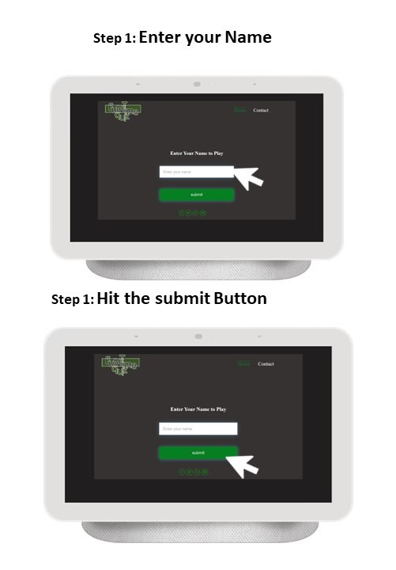

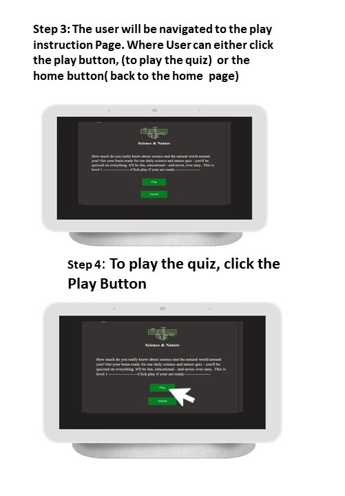

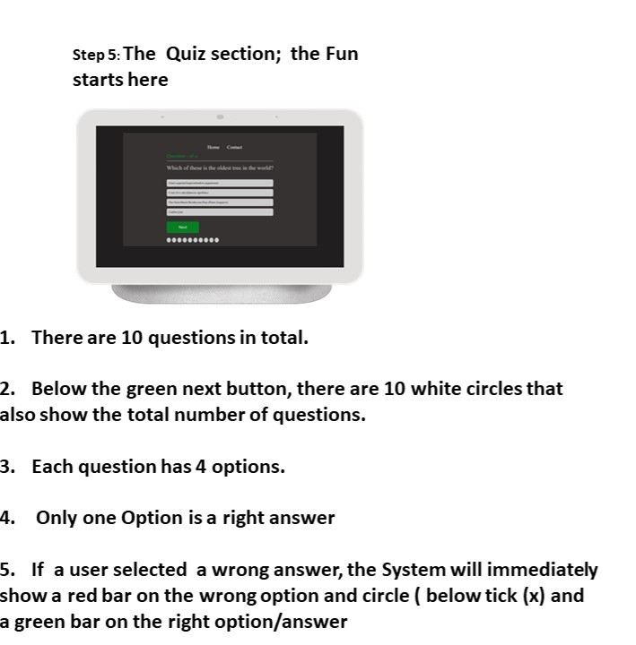


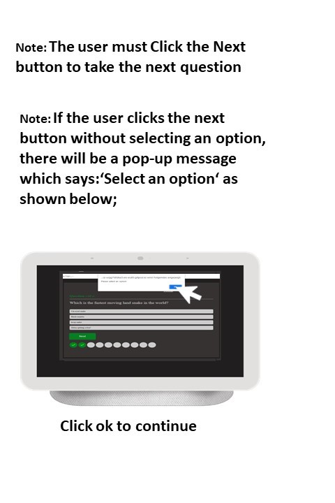

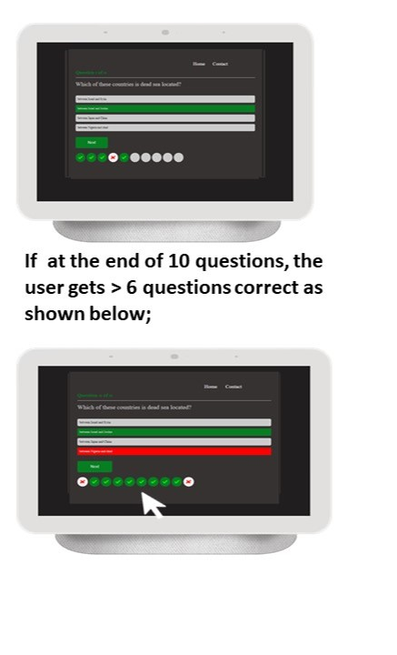

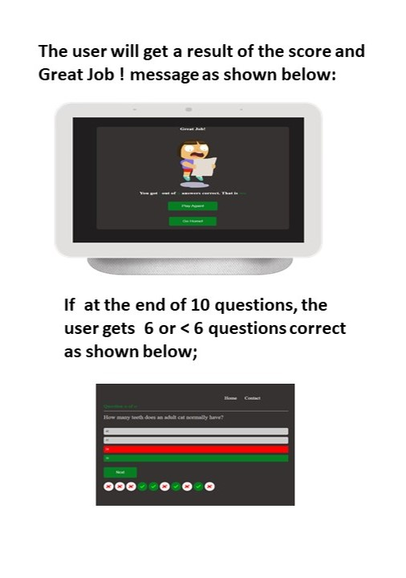

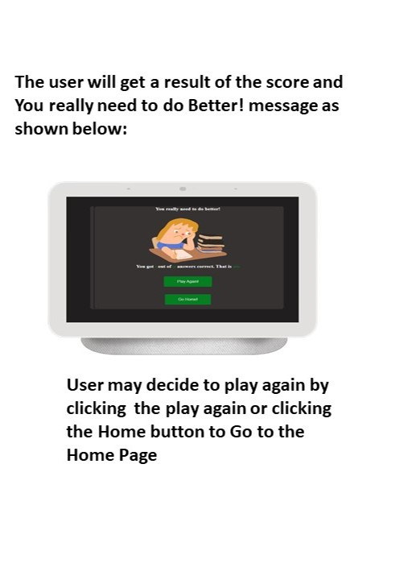


## Existent Features
*	Responsive design
*	There are some animations on the site
*	Contact form and thank you message
*	The the user must enter username be playing the game
*	There are buttons to to replay the Quiz and navigate you to the Home page


### Features Left to Implement

* 	As a future enhancement, the contact form will be updated with to send an email to “FunTime-Quiz 's email” and give the user notification information.
*	There would be dedicated Twitter, youtube, and Facebook handle dedicated to 'FunTime-Quiz'
*	There should Google map showing the location of FunTime-Quiz company
*   Timer  for the quiz will be implemented in the future
*	It should also in Future be a firm that is decated for Eductional quizzes for schools( both Primary and tericially institutions)

## Design

## Home Page

<br><br>

## Instruction Page

<br><br>

## contact Page
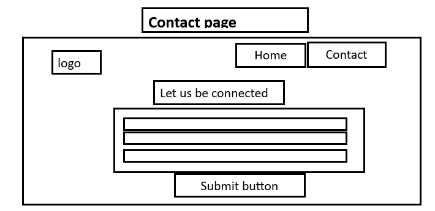
<br><br>

## contact Page

<br><br>


## Technologies

* HTML
    * The structure of the Website was developed using HTML as the main language.
* CSS
    * The Website was styled using custom CSS in an external file.
* Javascripts
    * The Website was interative using custom Javascript in an external file.
* Visual Studio Code
    * The website was developed using Visual Studio Code IDE
* GitHub
    * Source code is hosted on GitHub and delpoyed using Git Pages.
* Git 
    * Used to commit and push code during the development opf the Website
* Font Awesome
    * Icons obtained from https://fontawesome.com/ were used as the Social media links in the footer section. 
* Tinyjpg
    * https://tinyjpg.com/ was used to reduce the size of the images used throughout the website


## Testing 

### Responsiveness

All pages were tested to ensure responsiveness on screen sizes from 320px and upwards as defined in [WCAG 2.1 Reflow criteria for responsive design](https://www.w3.org/WAI/WCAG21/Understanding/reflow.html) on Chrome, Edge, Firefox and Opera browsers.

Steps to test:

1. Open browser and navigate to [FunTime-Quiz]( https://ujuadimora-dev.github.io/FunTime-Quiz/)
2. Open the developer tools (right click and inspect)
3. Set to responsive and decrease width to 320px
4. Set the zoom to 50%
5. Click and drag the responsive window to maximum width

Expected:

Website is responsive on all screen sizes and no images are pixelated or stretched.
No horizontal scroll is present.
No elements overlap.

Actual:

Website behaved as expected with the exception of switching to landscape . 

Website was also opened on the following devices and no responsive issues were seen:

- Oukitel C21 Pro
- TCL 30 Pro
- iPhone SE
- Samsung Galaxy Tablet

### Accessibility

[Wave Accessibility](https://wave.webaim.org/) tool was used throughout development and for final testing of the deployed website to check for any aid accessibility testing.

Testing was focused to ensure the following criteria were met:

- All forms have associated labels or aria-labels so that this is read out on a screen reader to users who tab to form inputs
- Color contrasts meet a minimum ratio as specified in [WCAG 2.1 Contrast Guidelines](https://www.w3.org/WAI/WCAG21/Understanding/contrast-minimum.html)
- Heading levels are not missed or skipped to ensure the importance of content is relayed correctly to the end user
- All content is contained within landmarks to ensure ease of use for assistive technology, allowing the user to navigate by page regions
- All not textual content had alternative text or titles so descriptions are read out to screen readers
- HTML page lang attribute has been set
- Aria properties have been implemented correctly
- WCAG 2.1 Coding best practices being followed

Manual tests were also performed to ensure the website was accessible as possible and an accessibility issue was identified.

Issue : After keyboard controls were implemented, while testing the site with windows 'Narrator' screenreader, it was not clearly known what the purpose of the labels/checkboxes were. An aria-label label was added to the labels for screen readers to alert them that the labels were clickable and what their purpose was. Note:  I was only able to perform thise text of th e time factor.

### Lighthouse Testing

### Home Page
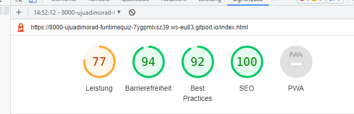

### Quiz Section

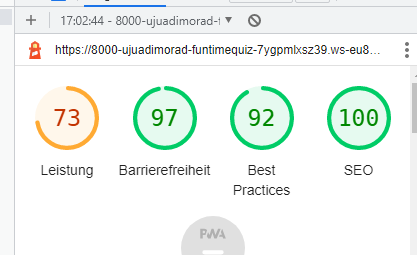

### Contact Page

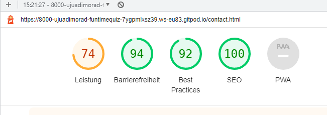

### Functional Testing

**Navigation Links**

Testing was performed to ensure all navigation links on the respective pages, navigated to the correct pages as per design. This was done by clicking on the navigation links on each page.

| Navigation Link | Page to Load    |
| --------------- | --------------- |
| Home            | index.html      |
| Contact Us      | contact.html    |

Links on all pages navigated to the correct pages as exptected.

**Form Testing**

The form on the  Home page was tested to ensure it functioned as expected when correct data was input and when incorrect data was input. The following test scenarios were covered:

_Scenario One - Correct Inputs_

Steps to test:

1. Navigate to [FunTime-Quiz - Home Page]( https://ujuadimora-dev.github.io/FunTime-Quiz/)
2. click the Contact us page  and fill in the  to the form and input the following data:
    Name: Uju
3. Click Submit
4. User should be redirected to Play.html as expected

Expected:

Form submits with no warnings or errors and the user is redirected to a play.html  page.

_Scenario two -  Inputs(nothing)
1. Navigate to [Home - FunTime-Quiz]( https://ujuadimora-dev.github.io/FunTime-Quiz/)
2. Scroll down to the form and input the following data:
   - First Name: blanK  
3. Click Submit
Expected:

The form does not submit and an Error is displayed to tell the user that the field is required.
Actual:
Website behaved as expected, error message was displayed and the form did not submit.


**Footer Social Media Icons / Links**

Testing was performed on the Font Awesome Social Media icons in the footer to ensure that each one opened in a new tab and that each one had a hover affec color.

Each item opened a new tab when clicked as expected and correct hover color was present.

**Contact form**
Testing was performed on the contact page . It will navigate the user to Thank-you.html , 

## Scenario One - Correct Inputs_

Steps to test:
## If the user inputs the user name and correct email with email format.
Username: Ada
Email; uju@gmail.com
Submit;
on clicking submit, It will navigate the user to Thank-you.html , 

#  Scenario two - blank Inputs_

Steps to test:
But  if the user e.g;
Username:
Email; uju@gmail.com
Submit;
on clicking submit, there will a message telling the user that name filed must not be empty

# Scenario One - in Correct email Inputs_

Steps to test:

But  if the user e.g;
Username: uju
Email; ujugmail.com
Submit;
on clicking submit, there will a message telling the user that email field must contain @ 

# Actual:
Website behaved as expected

### Validator Testing 

- HTML
  - No errors were returned when passing through the official [W3C validator](https://validator.w3.org)
### Home section

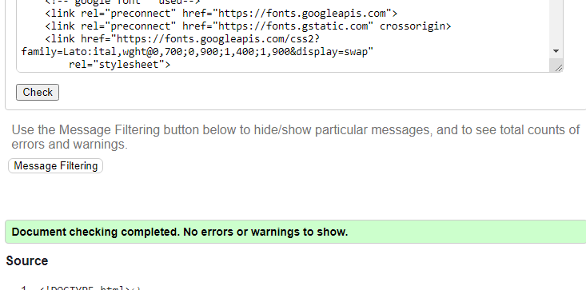

### Quiz section

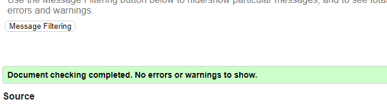

### contact section

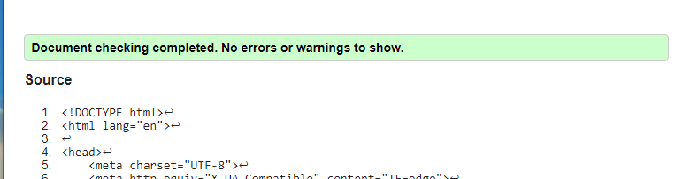


- CSS
  - There  was no found when passing through the official [(W3C validator]((https://validator.w3.org)

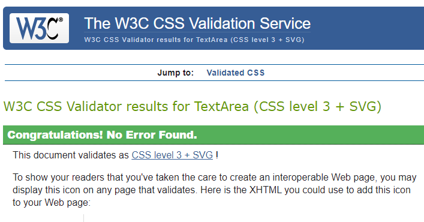
 * This is yet to be resolved, but will be address in future due time factor

### Unfixed Bugs
Responsiveness of the website worked on all devices, screen sizes and orientation with the exception of landscape orientation. it wil be taking care of in future 

## Deployment

### Version Control

The site was created using the Visual Studio code editor and pushed to github to the remote repository ‘FunTime-Quiz’.

The following git commands were used throughout development to push code to the remote repo:

```git add <file>``` - This command was used to add the file(s) to the staging area before they are committed.

```git commit -m “commit message”``` - This command was used to commit changes to the local repository queue ready for the final step.

```git push``` - This command was used to push all committed code to the remote repository on github.

### Deployment to Github Pages

- The site was deployed to GitHub pages. The steps to deploy are as follows: 
  - In the GitHub repository, navigate to the Settings tab 
  - From the menu on left select 'Pages'
  - From the source section drop-down menu, select the Branch: main
  - Click 'Save'
  - A live link will be displayed in a green banner when published successfully. 

The live link can be found here -  https://ujuadimora-dev.github.io/FunTime-Quiz/

### Clone the Repository Code Locally

Navigate to the GitHub Repository you want to clone to use locally:

- Click on the code drop down button
- Click on HTTPS
- Copy the repository link to the clipboard
- Open your IDE of choice (git must be installed for the next steps)
- Type git clone copied-git-url into the IDE terminal

The project will now of been cloned on your local machine for use.


## Credits 


* (https://www.w3schools.com/)
    *  some of the code was used from this site to create form. Styles were changed to suit styling on my Website. I recommend this site for every beginners.

   * https://stackoverflow.com]This site also help me in resovlving some issue in coding
    
* [Youtube Tutorial](https://youtu.be/2Bpiluefkh8),
    * I learn  lot from this video especially the  Javascript.


### Content 

All contents and  media or image on this site was Fantasy( all are fantasied by me )The with the help of pexel for their free pictures and .gif(https://tenor.com/),  some of the pictures or images are from these sites: Freeipks, Undraw, MS office  pictures garllery )

### Media

Website Logo was created by my me [Adimora Uju]( https://ujuadimora-dev.github.io/FunTime-Quiz/) using Microfot office powerpoint-

